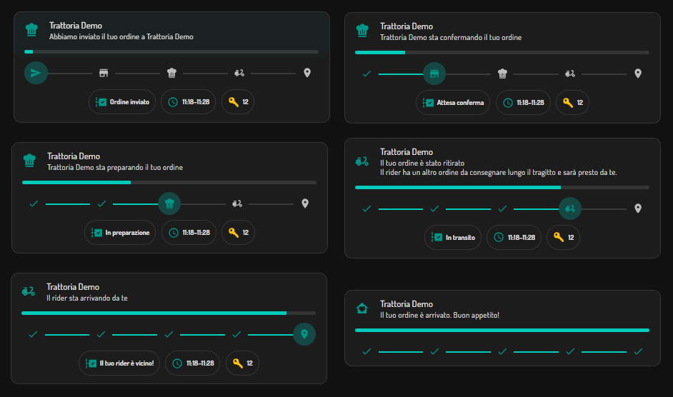

# Deliveroo for Home Assistant (unofficial)

Track your Deliveroo orders in Home Assistant: status, estimated arrival, progress and the
code to give the rider, with an event on every change so you can build automations
(notifications, turn on the porch light when the rider is on the way, …).



> **Unofficial.** Deliveroo has no public consumer API. This integration reads the same data the
> Deliveroo website uses. It can break at any time if Deliveroo changes its website, and
> automated access may be against Deliveroo's terms of service. Use at your own risk.
> Not affiliated with or endorsed by Deliveroo.

## Status

| Country | Status |
|---|---|
| Italy (`deliveroo.it`) | Tested |
| UK, Ireland, France, Belgium | Experimental: same pattern, not verified |

Feedback from other countries is welcome (open an issue with the diagnostics file).

## Installation

### HACS (custom repository)
1. HACS → ⋮ → **Custom repositories** → add `https://github.com/LordHenry76/ha-deliveroo`, category **Integration**.
2. Install **Deliveroo** and restart Home Assistant.
3. **Settings → Devices & services → Add integration → Deliveroo**.

### Manual
Copy `custom_components/deliveroo` into your `config/custom_components/` folder and restart.

## Configuration

You need the `consumer_auth_token` cookie of your Deliveroo session:

1. Log in on the Deliveroo website from a desktop browser.
2. Open the developer tools (F12) → **Application** (Chrome) / **Storage** (Firefox) → **Cookies** → `https://deliveroo.<country>`.
3. Copy the **value** of `consumer_auth_token` (it starts with `eyJ`) and paste it in the integration setup.

Things to know:

* **Do not log out** of the website afterwards: logging out invalidates the cookie. Just close the tab.
* Treat it like a password: it gives access to your Deliveroo account.
* **How long it lasts** is decided by Deliveroo and not documented. The expiry written inside the
  token is not enforced (tokens keep working well past it). When Deliveroo finally rejects it,
  Home Assistant asks you to re-authenticate with a fresh cookie.
* **Why not a normal login?** Deliveroo's login endpoints are protected by a browser challenge that
  only a real browser can pass. This integration does not try to get around it.

## Entities

| Entity | Description |
|---|---|
| `binary_sensor.<name>_active_order` | On while an order is in progress |
| `sensor.<name>_step` | Current step of Deliveroo's own timeline, e.g. "Preparing", "In transit" (localised by Deliveroo). Attributes: `step_index`, `step_count`, `steps` |
| `sensor.<name>_order_status` | `idle`, `processing`, `completed`, `failed`. Note: Deliveroo reports `processing` for the whole order, so use the step sensor to tell phases apart. Attributes: order id/number, `rider_route`, `rider_status`, ETA status |
| `sensor.<name>_status_message` | Deliveroo's status text. Attribute `advisory`: extra notice, e.g. the rider has another delivery on the way |
| `sensor.<name>_estimated_arrival` | Arrival window as shown by Deliveroo, e.g. `20:20–20:50` |
| `sensor.<name>_estimated_delivery_time` | Estimated delivery as a timestamp, for automations |
| `sensor.<name>_progress` | Progress in % |
| `sensor.<name>_rider_code` | Code to give to the rider |
| `sensor.<name>_restaurant` | Restaurant name |
| `button.<name>_refresh_now` | Check for a new order immediately |
| `button.<name>_simulate_order` | Replay a demo order (see below) |

Entity ids follow your Home Assistant language (e.g. `sensor.<name>_fase` in Italian).

## Options

**Settings → Devices & services → Deliveroo → Configure** lets you change the polling intervals:

| Option | Default | Range |
|---|---|---|
| Check for new orders every | 30 s | 15–900 s |
| Update an active order every | 20 s | 10–120 s |

Checking for new orders is a tiny API request (a few dozen bytes when there is no order),
so a short interval is fine. If you ever see rate-limit errors in the log, increase it.

## Event

`deliveroo_order_update` fires whenever the step, status, message, advisory, ETA or rider route changes:

```yaml
triggers:
  - trigger: event
    event_type: deliveroo_order_update
actions:
  - action: notify.mobile_app_iphone
    data:
      title: "🛵 {{ trigger.event.data.restaurant }}"
      message: >
        {{ trigger.event.data.message }}
        - ETA {{ trigger.event.data.eta }}
        - rider code {{ trigger.event.data.rider_code }}
```

Event data: `order_id`, `state`, `step`, `step_index`, `step_count`, `message`, `advisory`, `eta`,
`eta_status`, `estimated_delivery`, `progress`, `rider_route`, `rider_status`, `rider_code`,
`restaurant`, `is_completed`, `is_failed`, `simulated`, `config_entry_id`.

## Dashboard card

The card in the picture above is in [`examples/order-card.yaml`](examples/order-card.yaml)
(Italian entity ids and texts: [`examples/order-card.it.yaml`](examples/order-card.it.yaml)).
It stays compact while idle and expands during an order: progress bar, the five-step timeline,
current step, arrival time and rider code.

It needs three frontend cards from HACS: [Mushroom](https://github.com/piitaya/lovelace-mushroom),
[card-mod](https://github.com/thomasloven/lovelace-card-mod) and
[Vertical Stack In Card](https://github.com/ofekashery/vertical-stack-in-card).

Entity ids depend on your Home Assistant language, on the account name and on the area of the
device, so check yours in **Settings → Entities** and find/replace them in the file before pasting.

## Try it without ordering

Press **Simulate order** (on the device page, under *Diagnostic*) to replay a full demo delivery
in about two and a half minutes: the five steps, progress, arrival time, rider code and the final
delivery. It drives the same sensors and fires the same `deliveroo_order_update` events as a real
order, so you can build and check dashboards and notifications. Deliveroo is not contacted while
the demo runs.

Demo events carry `simulated: true`. To keep the demo out of an automation, add a condition:

```yaml
conditions:
  - condition: template
    value_template: "{{ not trigger.event.data.simulated }}"
```

## How it works

The cookie value is a token that Deliveroo's API accepts directly, so the integration only talks
to the API host (`api.<country>.deliveroo.com`):

* **Idle:** every 30 seconds (configurable) it asks for your orders in progress.
  The answer is a few dozen bytes when there are none.
* **During an order:** it polls the order tracking endpoint every 20 seconds (configurable) and
  goes back to idle as soon as the order is delivered or cancelled.
* **Website:** the order history web page is not needed. It is visited every 6 hours as a
  best-effort keep-alive (a failure there is harmless), and when the API rejects the token, in
  case Deliveroo has issued a new one, which is then saved automatically.
* **Fallback:** if the lightweight API is unavailable (for example in an untested country), the
  integration detects orders from the web page instead, at most every 2 minutes, and retries the
  API after an hour.

## Diagnostics

**Settings → Devices & services → Deliveroo → ⋮ → Download diagnostics** exports the raw
order status (tokens, phone numbers, links and rider notices are redacted). Please attach it to issues about
unknown states.

## Brand images

The integration ships its icon and logo in `custom_components/deliveroo/brand/`, picked up
automatically by Home Assistant 2026.3 or newer (older versions just show no icon).
The Deliveroo name and logo are trademarks of Roofoods Ltd, used for identification purposes only.

## Development

```bash
pip install pytest-homeassistant-custom-component
pytest -q
```

## Roadmap

- Login with email + one-time code directly in the config flow (no cookie copying).
- Verified support for more countries.
